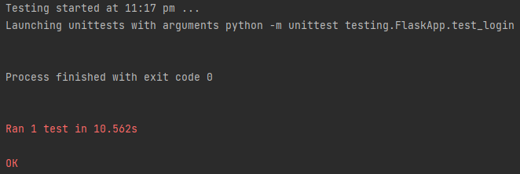
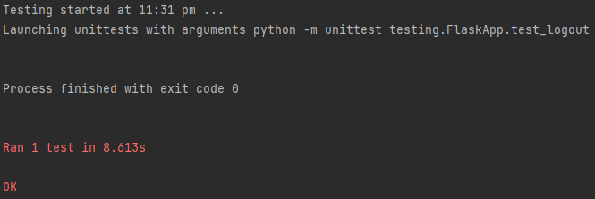
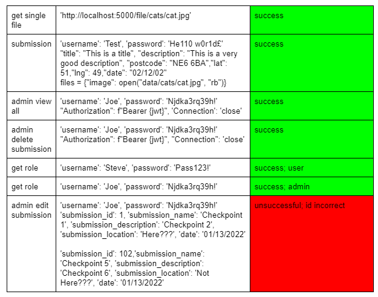

# Testing Document

## Introduction
This document provides details on how we tested the back-end system
handling inputs from front-end. We do this by testing each function
on what it should receive and what it should send back as a response.
We tested glue-code whenever the front-end page and back-end functionality
was completed. We do not put glue code in this document as any glue-code
errors that do occur will cause fatal errors.

### Empty Value function
This tests if an input that is sent from front-end is empty or filled
with empty spaces. We do this by sending several dictionaries that
have values with either nothing in them, spaces or some characters.

### Hello_World function
This function shouldn't receive anything from front-end and is here,
to check if glue-code is working and back-end is running. It does by
see what is loaded when given the url to go to.

### Register function
We tested register via sending inputs as a user trying to register
an account. We test any possible errors that the user could submit:
nothing being sent in incorrect username, entering a bad email,
postcode that doesn't match the correct formatting, a password that
doesn't follow any of the conditions and, finally all the correct fields.

### Login function
This should allow a user to log in with there registration information,
assuming they have registered. We test a user inputs for: empty fields,
incorrect username, incorrect password and finally correct details. This
should work for admins and users.

### Logout function
This logs a user in and then goes to the logout url and should log the
user out of the website, however this should be done in front-end as
the back-end doesn't have access to cookies. So we just test if we are
able to go to the url and get a status code of 200.

### Get Single File function
This allows a file to be viewed in the back-end server. We test this by
going to the url with a file and see if the status code is 200 and the
file is visible on the back-end server.

### Get Role function
The function just sends the front-end the role of the currently
logged-in user. This is tested by logging-in a user account which
should produce a status-code of 201 and produce the json text 'user'.
Then we log in an admin account and the server should produce a status
code of 201 and the json text 'admin'.

### Submission function
The function allows the user that's logged in to submit a complaint
which is then stored to the database. This is tested by first logging
a user that's not an admin and then seeing if a valid submission can
be sent, with the correct file. We then wait for the url to produce
a status-code of 200.

### Admin View All function
This function allows an admin to see up to 20 complaints that are
stored in the database. We test this by logging the user in as an
admin and then from there check if the url request produces a status
code of 200 meaning there are no errors.

### Admin Delete function
This allows an admin to delete certain complaints. We test this by
logging in as an admin and then give the id of an existing of complaint
and see if what status code is produced. If it produces 201 then the
deletion of the complaint was successful, and then we try again to delete
the same complaint which doesn't exist making the status code change to 500.

### Admin Edit Submission function
We test this function by logging-in as an admin account and then submit
the complaint id and the details of the submission wanting to be changed.
Once the server produces a status-code of 201 we try to edit another complaint
that doesn't exist and the server should produce a status-code of 406.

### Table of Test

